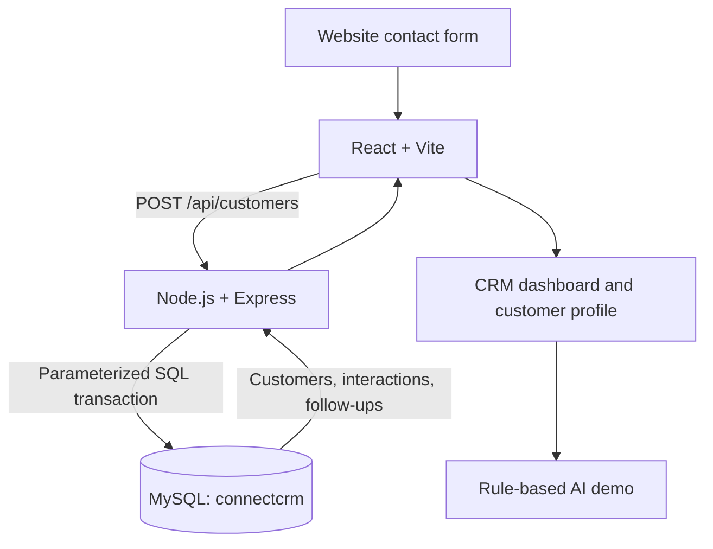

# Architecture

## Request Flow

The frontend uses `src/services/api.js` as its only API client. During Vite development, `/api` is proxied to the backend; `VITE_API_PROXY_TARGET` changes that target without scattering URLs through UI components.

## Data Model

- `customers` stores contact details, lead status, service interest, enquiry text, and creation time.
- `interactions` stores form submissions, notes, calls, email/WhatsApp demo entries, and status changes.
- `followups` stores the planned date, note, and pending/completed state.

These are the existing project tables. `backend/schema.sql` uses `CREATE TABLE IF NOT EXISTS` to support a fresh setup without replacing existing tables or records.

## Safety Boundaries

All SQL values are parameterized. The database connection reads credentials from `backend/.env`, which is ignored by Git. AI suggestions are generated from saved CRM data in rule-based demo mode. Email, WhatsApp, and call actions only record a planned interaction; they do not contact a customer.